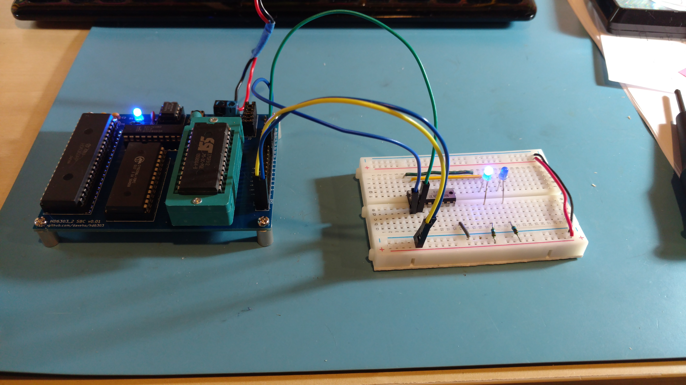

# HD6303 microcomputer project

This is a project to build a small computer using the Hitachi HD6303RP microprocessor.

## About the HD6303RP

It's an 8 bit CPU that supports an extended version of the Motorola 6800 instruction set.

Because it has some built-in peripherals (timer, UART) and 128 bytes of internal RAM, it could be considered a microcontroller.  However, it has no internal program memory, and code must be run from an external ROM.

# Circuits

So far, two successful circuits have been built and tested:

* [Minimal circuit](minimal.md)
* [Improved circuit](improved.md)

There is a PCB for the improved circuit:

The data bus, lowest 10 address lines, I/O pins, and other useful signals are available on a 40 pin header, alowing the circuit to be interfaced with other peripherals.

# Future plans

I'm planning to get the UART working, and then writing some kind of monitor program.  I also plan to experiment with interfacing with some external devices.

# More info

Contact <david.hovemeyer@gmail.com>.
