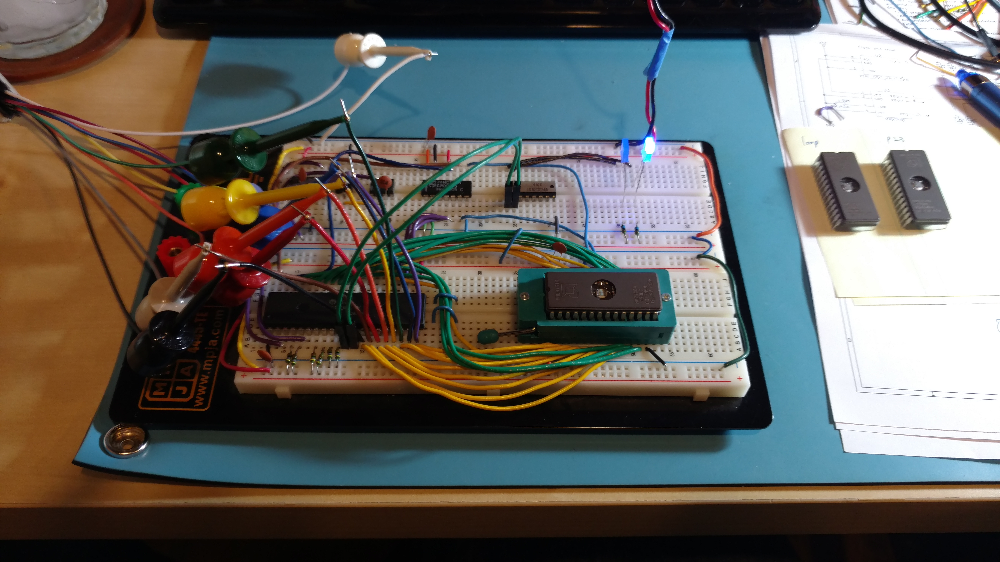

# HD6303 microcomputer project

This is a project to build a small computer using the Hitachi HD6303RP microprocessor.

## About the HD6303RP

It's an 8 bit CPU that supports an extended version of the Motorola 6800 instruction set.

Because it has some built-in peripherals (timer, UART) and 128 bytes of internal RAM, it could be considered a microcontroller.  However, it has no internal program memory, and code must be run from an external ROM.

# Circuits

So far there have been two successful experiments.

## Minimal circuit

The minimal circuit has a single 27C64 EPROM, and controls two LEDs using pins P23 and P24.  The KiCAD project is in the `hw_min` directory.



The test program [blink\_min.asm](fw/blink_min.asm) blinks the LEDs.  Build it using the command

```bash
make blink_min.bin
```

You'll need [dasm](http://dasm-dillon.sourceforge.net/).  The resulting image, `blink_min.bin`, can be burned into an 27C64 EPROM.  I use the Minipro TL866CS, which works very nicely under Linux using Wine.

## Improved circuit

The improved circuit has a 32K static RAM (62256 or similar) and a 64K flash ROM (SST27SF), only 28K of which is used.


The test program [blink2.asm](fw/blink2.asm) blinks LEDs connected to P23 and P24 (same as the minimal circuit.)  Note that the ULN2003A transistor array isn't shown in the schematic, but it's connected the same way as in the minimal circuit.  Build the test program using the command

```
make blink2.bin
```

and burn the resulting image into a 27C512 EPROM, SST27SF512 flash ROM, or similar.

The memory map is

```
$0000-$7FFF   static RAM (except low 256 bytes shadowed by internal registers/RAM)
$8000-$8FFF   4K area for external I/O devices
$9000-$FFFF   flash ROM
```

Glue logic is implemented using a GAL16V8.  [Galasm](https://github.com/daveho/galasm) is needed to compile the logic equations (in [glue.pld](pld/glue.pld)).  The TL866 can program both the GAL and the flash ROM.

The KiCAD project is in the `hw2` directory.  A circuit board has been designed and ordered, but it hasn't arrived yet :-)

# Future plans

I'm planning to get the UART working, and then writing some kind of monitor program.  I also plan to experiment with interfacing with some external devices.

# More info

Contact <david.hovemeyer@gmail.com>.
