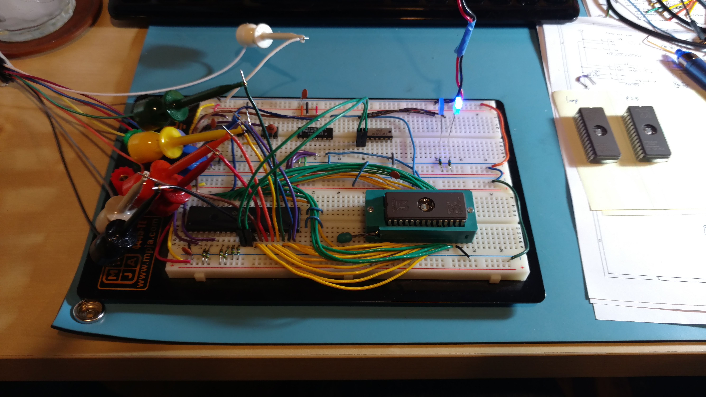

# HD6303 minimal circuit

The minimal circuit has a single 27C64 EPROM, and controls two LEDs using pins P23 and P24.  The KiCAD project is in the `hw_min` directory.



The test program [blink\_min.asm](fw/blink_min.asm) blinks the LEDs.  Build it using the command

```bash
make blink_min.bin
```

You'll need [dasm](http://dasm-dillon.sourceforge.net/).  The resulting image, `blink_min.bin`, can be burned into an 27C64 EPROM.  I use the Minipro TL866CS, which works very nicely under Linux using Wine.

